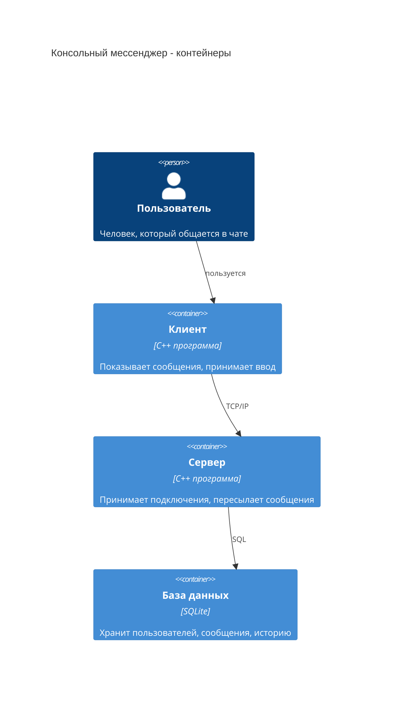

```markdown
## Консольный мессенджер

#### Диаграмма контейнеров (C4)


```mermaid
C4Container
    title Консольный мессенджер - контейнеры

    Person(user, "Пользователь", "Человек, который общается в чате")
    
    Container(client, "Клиент", "C++ программа", "Показывает сообщения, принимает ввод")
    
    Container(server, "Сервер", "C++ программа", "Принимает подключения, пересылает сообщения")
    
    Container(db, "База данных", "SQLite", "Хранит пользователей, сообщения, историю")
    
    Rel(user, client, "пользуется")
    Rel(client, server, "TCP/IP")
    Rel(server, db, "SQL")
```
```
