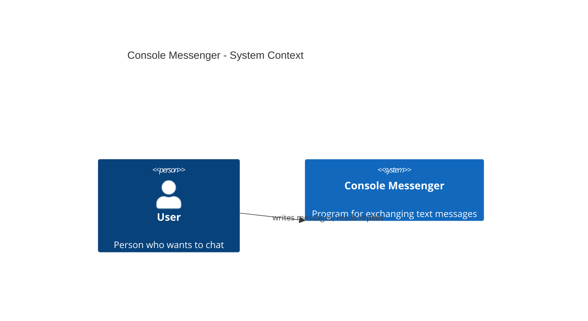
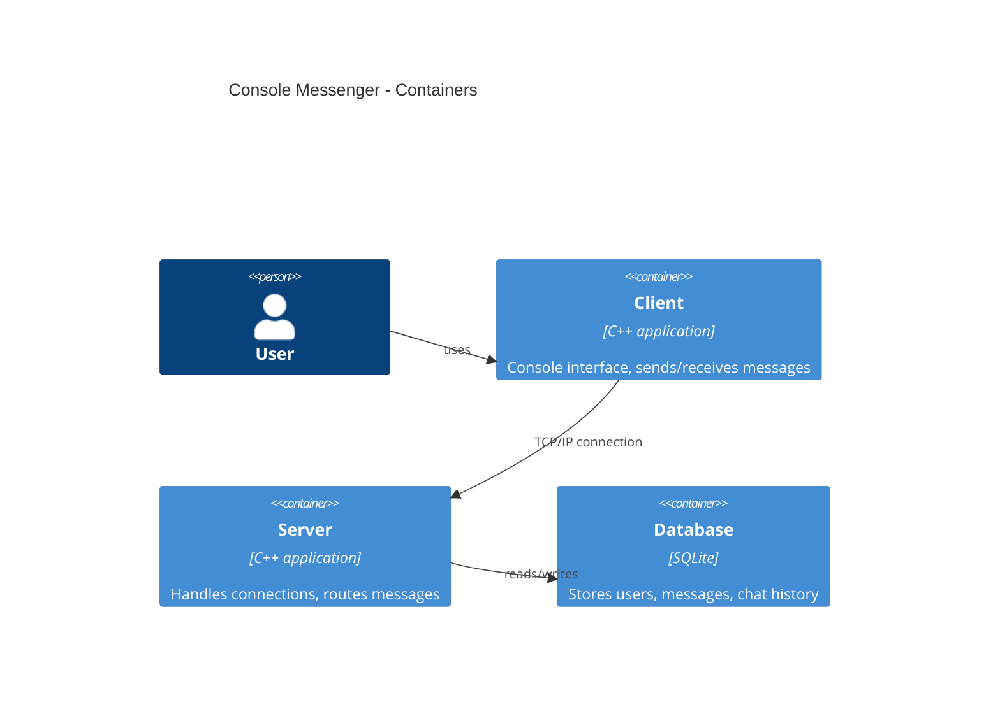
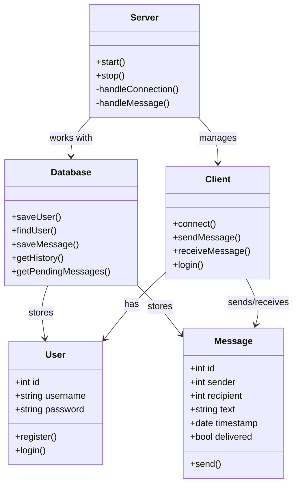

# Console Messenger

**DISCLAIMER:** This project is a final assignment for the Otus course and demonstrates the implementation of a console-based messaging system.

Use this application if you want to communicate with other users through a centralized server, exchange text messages in real-time, and store message history. Perfect for understanding client-server architecture, network programming, and database integration in C++.

## Basic Information

- **C++ 17** required (or C++20 for modern features)
- Uses **Boost.Asio** for asynchronous network operations
- Client-server architecture with TCP/IP communication
- Messages are **persistently stored** in SQLite database

## Behaviour

- When a user sends a message, the server:
  I. Saves it to the database
  II. Checks if the recipient is online
  III. Delivers immediately if online, or stores for offline delivery
- Users receive **offline messages** upon connecting
- Message history is **loaded** when entering a chat
- Connection is **persistent** — stays open until user exits

## Features

| Feature | Status | Description |
|---------|--------|-------------|
| User registration | ✅ | Create new account with login/password |
| Authentication | ✅ | Login with existing credentials |
| Offline messages | ✅ | Messages stored and delivered when recipient connects |
| Message history | ✅ | Load previous messages from database |

## Possible Future Improvements

- **Message search** — find messages by content or date
- **Message reactions** — add emoji reactions to messages
-  **Protocol Buffers** -for efficient message serialization (compact binary format, versioning support)

## Architecture

### System Context (C4 Level 1)


### Containers (C4 Level 2)


### Command Flow Diagram

```mermaid
flowchart TD
    Start([Start]) --> Input[User enters /send]
    
    Input --> Connect{Connection established?}
    
    Connect -- Yes --> Send[Send data]
    Connect -- No --> Error[Display "No connection"]
    Error --> Input
    
    Send --> Save{Server saved to DB?}
    
    Save -- Yes --> Check{Recipient online?}
    Save -- No --> Retry[Retry]
    Retry --> Send
    
    Check -- Yes --> Deliver[Deliver immediately]
    Check -- No --> Store[Place in queue]
    
    Deliver --> Success([Message delivered])
    Store --> Pending([Awaiting recipient])
```

## Class Diagram: Messaging System


