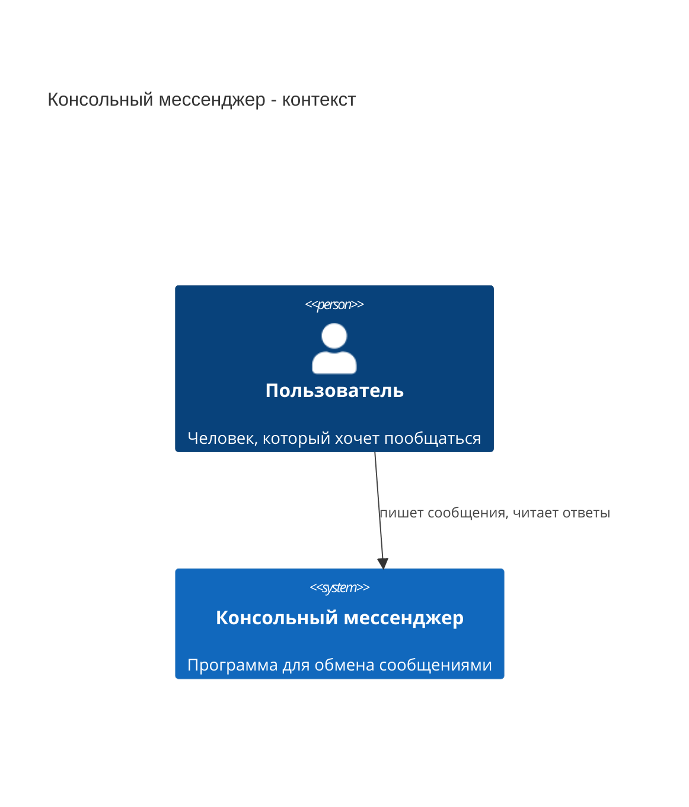

## Консольный мессенджер

#### Диаграмма контекста (C4)

```mermaid
C4Context
    title Консольный мессенджер - контекст
    
    Person(user, "Пользователь", "Человек, который хочет пообщаться")
    System(messenger, "Консольный мессенджер", "Программа для обмена сообщениями")
    
    Rel(user, messenger, "пишет сообщения, читает ответы")
```
