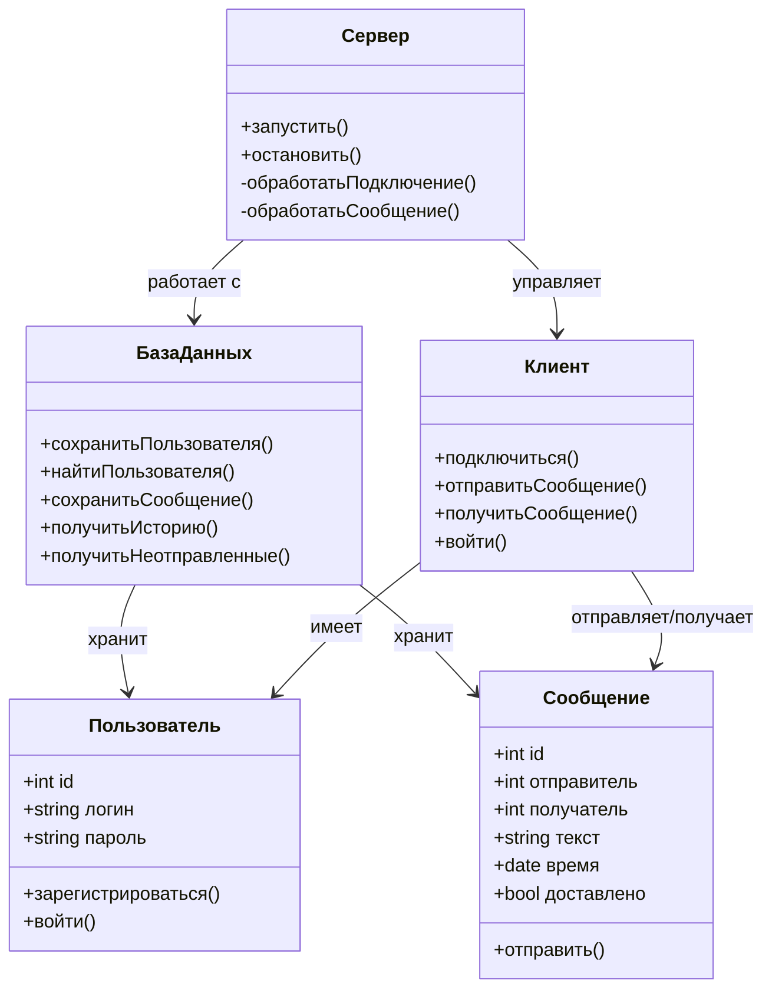

## Консольный мессенджер

#### UML-диаграмма классов

```mermaid
classDiagram
    class Сервер {
        +запустить()
        +остановить()
        -обработатьПодключение()
        -обработатьСообщение()
    }
    
    class Клиент {
        +подключиться()
        +отправитьСообщение()
        +получитьСообщение()
        +войти()
    }
    
    class Пользователь {
        +int id
        +string логин
        +string пароль
        +зарегистрироваться()
        +войти()
    }
    
    class Сообщение {
        +int id
        +int отправитель
        +int получатель
        +string текст
        +date время
        +bool доставлено
        +отправить()
    }
    
    class БазаДанных {
        +сохранитьПользователя()
        +найтиПользователя()
        +сохранитьСообщение()
        +получитьИсторию()
        +получитьНеотправленные()
    }
    
    Сервер --> БазаДанных : работает с
    БазаДанных --> Пользователь : хранит
    БазаДанных --> Сообщение : хранит
    Клиент --> Пользователь : имеет
    Клиент --> Сообщение : отправляет/получает
    Сервер --> Клиент : управляет
```
